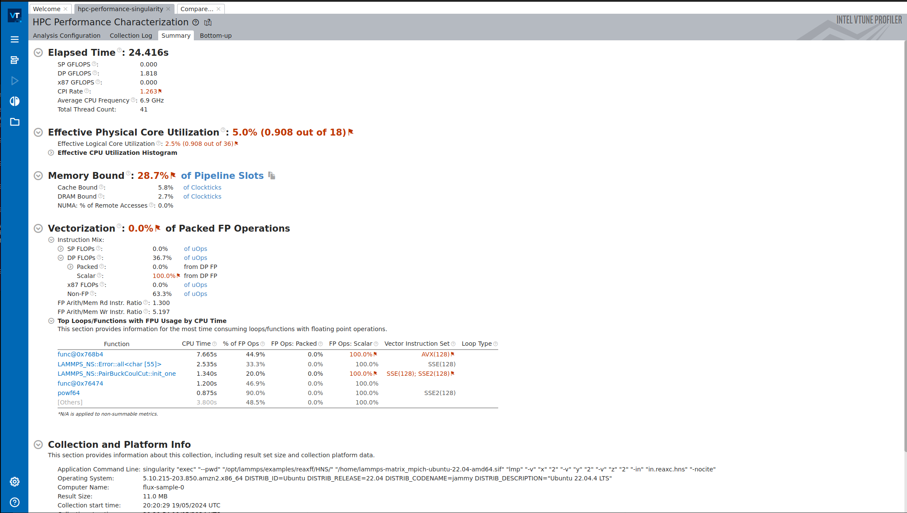

# Descriptive Expression + Scheduler Brainstorm

> Testing vtune with lammps variants on Kubernetes

We are going to create a Kubernetes cluster that has support for EFA and vPMU. See [testing-vtune](../testing-vtune) and [singularity-prototype](../singularity-prototype) for background on that.
The high level idea is that lammps can be "[acclerated](https://www.hpc-carpentry.org/tuning_lammps/05-accelerating-lammps/index.html)" with both runtime flags and hardware. Thus, we can create many (almost) equivalent clusters that vary in features to do that including:

 - OMP (for Pair operators)
 - Kokkos (any architecture)
 - OpenMP
 - GPU (more advanced, expensive)
 - Intel

This setup is based on a simple hypothesis that we can find interesting patterns of performance _within_ a single application. Or in other terms, instead of trying to run many different apps superficially, get to know one specific application really well.
Further, there are a ton of examples already provided with lammps, so very naively I am building a container base that can support them all, and then I want to test how varying command line flags (packages) can influence runtime.
Since each parameter file is also just a text file, we could do some kind of generation of novel ones as templates, if we think we can safely do that. At the end of the day we need to match the flags (runtime or hardware on a cluster that are needed) to
compatibility metadata, and then we can say something about the metadata provided being able to orient it to run better. What is better? We can measure runtime, but I've also chosen the instance type above so vtune works.

## Containers

Note that the default build of lammps had a bug with mdi - so do NOT build this headless with docker, you'll want to shell in and interatively do it. I found there was a path error for libdmi.a. It needed to be `mdi_build_ext/lib/mdi/libmdi.a` in both the CMakeLists.txt lmp.dir/build.make and link.make for the executable to finish. Yuck, but at least I could fix it and it worked.

The builds are in [docker](docker) and I'm still using locally, will push at some point.


## Testing

Here we will test creating a cluster, running a single problem with lammps and vtune, saving and exporting the report, and looking at it locally. Likely we will want to export the csv variant for further analysis.
I will also pull the equivalent container down with singularity to run `vtune-gui` locally.

### 1. Create Cluster

```bash
eksctl create cluster -f crd/eks-config.yaml
```

Install the flux operator.

```bash
kubectl apply -f https://raw.githubusercontent.com/flux-framework/flux-operator/main/examples/dist/flux-operator.yaml
```

Try creating the interactive minicluser.

```bash
kubectl apply -f crd/minicluster.yaml
```

Shell in.

```bash
kubectl exec -it flux-sample-0-xxx bash
. /mnt/flux/flux-view.sh 
flux proxy $fluxsocket bash
flux resource list
```

### 2. Sanity Check vPMU

Check for vPMU support:

```bash
cat /proc/cpuinfo | grep arch_perfmon
```

### 3. LAMMPS standalone

Try running lammps without flux:

```bash
lmp -v x 1 -v y 1 -v z 1 -in in.reaxc.hns -nocite
```

Wrap vtune.

```bash
vtune -collect hpc-performance -data-limit=0 -r hpc-performance lmp -v x 1 -v y 1 -v z 1 -in in.reaxc.hns -nocite
```

YES! It worked! Holy hell I tried this like 8 different times. There is something to say for being a stubborn idiot.
Pull the singularity image to both nodes:


```bash
flux exec --dir /home singularity pull docker://ghcr.io/rse-ops/lammps-matrix:mpich-ubuntu-22.04-amd64 
```

Let's try singularity. I also needed to do:

```
flux exec apt-get install -y locales
flux exec -- /bin/bash -c "locale > /etc/localtime"
```

This worked:

```
singularity exec --pwd /opt/lammps/examples/reaxff/HNS/ /home/lammps-matrix_mpich-ubuntu-22.04-amd64.sif lmp -v x 1 -v y 1 -v z 1 -in in.reaxc.hns -nocite
```

Let's add vtune

```bash
vtune -collect hpc-performance -data-limit=0 -r hpc-performance-singularity singularity exec --pwd /opt/lammps/examples/reaxff/HNS/ /home/lammps-matrix_mpich-ubuntu-22.04-amd64.sif lmp -v x 2 -v y 2 -v z 2 -in in.reaxc.hns -nocite
```

That also worked.


### 4. LAMMPS with flux

```bash
unset LD_LIBRARY_PATH
flux run -N1 -n 18 -ompi=openmpi@5 -c 1 -o cpu-affinity=per-task  lmp -v x 2 -v y 2 -v z 2 -in in.reaxc.hns -nocite
```
Works!

Add vtune

```bash
flux run -N1 -n 18 -ompi=openmpi@5 -c 1 -o cpu-affinity=per-task  vtune -collect hpc-performance -data-limit=0 -r flux-single lmp -v x 2 -v y 2 -v z 2 -in in.reaxc.hns -nocite
```

Note we might want a different mode?

```console
vtune: Analyzing data in the node-wide mode. The hostname (flux-sample-0) will be added to the result path/name.
```

This is also concerning:

```
ERROR: ld.so: object 'libittnotify_collector.so' from LD_PRELOAD cannot be preloaded (cannot open shared object file): ignored.
ERROR: ld.so: object 'libittnotify_collector.so' from LD_PRELOAD cannot be preloaded (cannot open shared object file): ignored.
```

vtune AND singularity gave me an error (above) and mpi seemed to throw up.

```bash
flux run -N1 -n 18 -ompi=openmpi@5 -c 1 -o cpu-affinity=per-task  vtune -collect hpc-performance -data-limit=0 -r flux-single-singularity singularity exec --pwd /opt/lammps/examples/reaxff/HNS/ /home/lammps-matrix_mpich-ubuntu-22.04-amd64.sif lmp -v x 2 -v y 2 -v z 2 -in in.reaxc.hns -nocite
```

Now two nodes (testing first)

```bash
flux run -N2 -n 36 -ompi=openmpi@5 -c 1 -o cpu-affinity=per-task  lmp -v x 3 -v y 3 -v z 3 -in in.reaxc.hns -nocite
```

And with vtune

```bash
flux run -N2 -n 36 -ompi=openmpi@5 -c 1 -o cpu-affinity=per-task vtune -collect hpc-performance -data-limit=0 -r flux-two-node lmp -v x 2 -v y 2 -v z 2 -in in.reaxc.hns -nocite
```

Let's stick with vtune and lammps and without singularity for now. Likely I'm missing a host library. If/when the host/container are the same this might work.


## Exploring Examples

That's wicked! Let's copy a report over to our local machine so we can try the gui.

```bash
mkdir save
mv flux-single* save/
mv flux-two-node* save/
kubectl cp flux-sample-0-xxx:/opt/lammps/examples/reaxff/HNS/save ./report-multi
```

That will generate [report-multi](report-multi) for us to open in the vtune-gui.
We are going to do this off of the cloud, since we have the container.

```bash
docker build -f ./docker/vtune-gui/Dockerfile -t ghcr.io/converged-computing/rainbow-experiments:vtune .
docker push ghcr.io/converged-computing/rainbow-experiments:vtune
singularity pull docker://ghcr.io/converged-computing/rainbow-experiments:vtune
```

Then shell in, and target the `vtune-gui` to our report directory.

```
singularity shell rainbow-experiments_vtune.sif
> vtune-gui ./report
> vtune-gui ./report-multi/flux-single.flux-sample-0/
```

That will show you the nice web UI!



Note that (for our actual performance study) we likely want to export the csv from the output directory and cleanup the output directory. I'll also try to figure out how to do that.

```bash
vtune -report callstacks -r report/ -format=csv > callstacks.csv
vtune -report hotspots -r report/ -format=csv > hotspots.csv
```

When you are done:

```bash
eksctl delete cluster -f crd/eks-config.yaml
```

## LAMMPS

Here are some early tests with lammps that find some difference via command line flags.
This first is the "OMP" performance accelerator:

```
cd /opt/lammps/examples/reaxff/HNS
# 1 minute 27 seconds
lmp -in in.reaxff.hns -var x 4 -var y 4 -var z 4

# 37 seconds!
lmp -in in.reaxff.hns -sf omp -pk omp 18 neigh no -var x 4 -var y 4 -var z 4
```

And now one with kokkos. I think this is typically intended for GPU, but I found params I can add to slow it down by two seconds.

```bash
cd /opt/lammps/examples/common
# 20 seconds
lmp -k on -sf kk -pk kokkos newton on neigh full comm device -in in.snap.test -var snapdir 2J8_W.SNAP -v x 64 -v y 64 -v z 64 -var nsteps 1000

# 18-19 seconds
lmp -k on -sf kk -pk kokkos newton on neigh half -in in.snap.test -var snapdir 2J8_W.SNAP -v x 64 -v y 64 -v z 64 -var nsteps 1000
lmp -in in.snap.test -var snapdir 2J8_W.SNAP -v x 64 -v y 64 -v z 64 -var nsteps 1000
```

