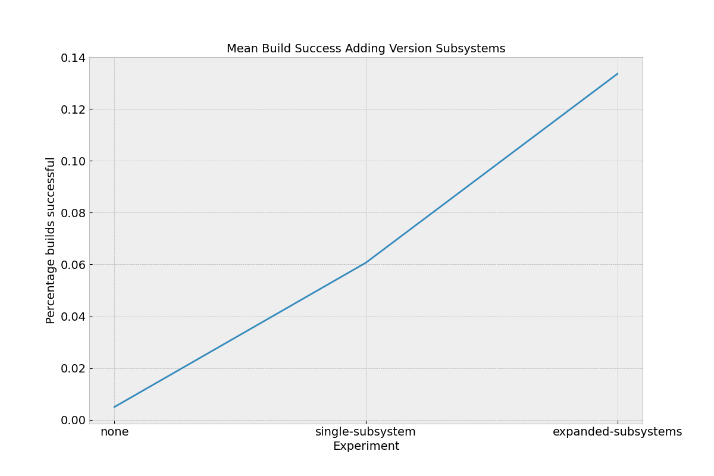
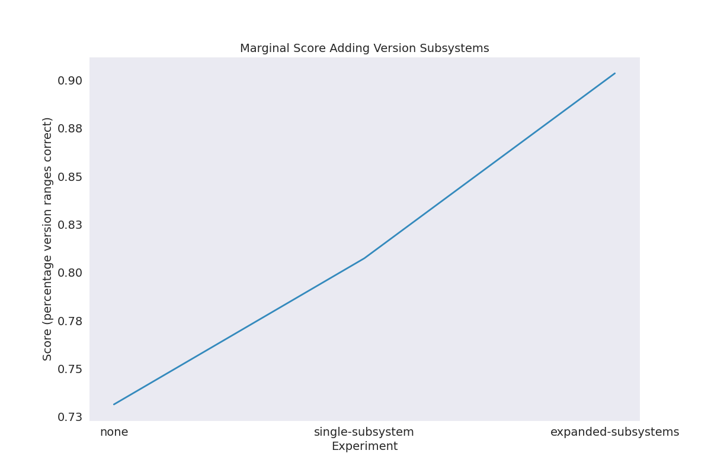
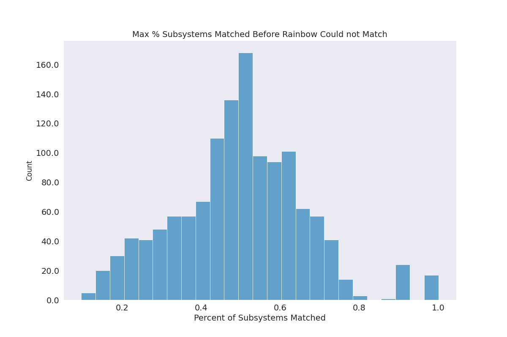
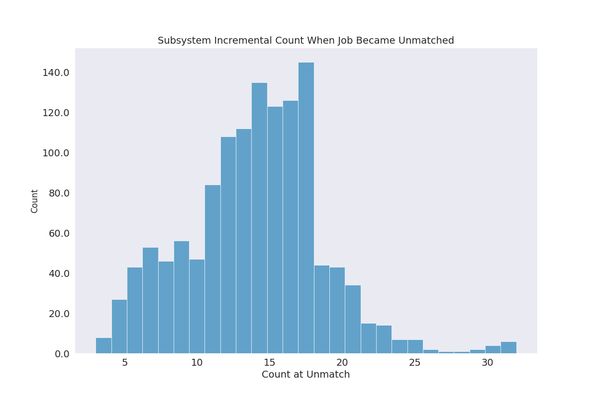

# Descriptive Expression + Scheduler Simulation

> Algorithm: direct match with reliabuild metadata

- [publication](https://www.osti.gov/biblio/2223030)
- [build spec generator](https://github.com/buildsi/spack-buildspace-exploration)

We started with a base simulation in [simulation-lammps](../simulation-lammps) and this experiment aims to take a new angle - bringing in the dimension of being able to match a range of versions for compatibility. Specifically, we have spack builds that we know were successful with specific versions of software, and we can:

1. prepare clusters with randomly selected versions
1. associate each successful build dependency version with a range (making the assumption the range will allow to build)
1. ask rainbow to assign builds based on matching version ranges (the cluster is in the range the build needs for one or more dependencies)

For the above, we are interested to know:

1. How many builds would be successful based on having all dependencies in the matched ranges
1. The change in matching clusters as we add compatibility metadata (more dependency version constraints)
1. The marginal points (number of version ranges that were right, even if the build might fail) for each.
1. Patterns of the above across cases of providing no compatibility metadata, metadata for one subsystem (package dependency) and then increasing numbers of subsystems
1. The incremental addition (number of subsystems) that deemed rainbow could not match the job anywhere.

This obviously is an imperfect experiment - and indeed I worked days on it and am still not happy. The reasons are because the number of clusters will influence the result, along with the choice I made about how large each version range it. It ultimately turned into a game of matching version ranges for a set of known building packages, and assuming that if we broke that range it would not be a successful build (not necessarily true, but very possible knowing spack). Despite that, I think the addition to rainbow to support matching a range is useful, and this experiment can help to start thinking for better experiments. We likely need a similar dataset to this one, but with metadata more true to something not building (e.g., arch, MPI, that sort of thing).

I kept very detailed results so minimally the code might be refactored to do something better.

### Experiment

An overview of the experiment is the following. See [details](#details) for more of that.

1. For the real dataset (spack specs) filter down to those that were successful. We know they build.
1. The package dependency versions are the features. This means rainbow needed an algorithm addition to match a version range [PR](https://github.com/converged-computing/rainbow/pull/21).
1. Create 100 cluster environments that have a randomly selected version (from the set in the experiment)
1. One level of compatibility metadata is a dependency version. Submit jobs to rainbow, first with no metadata, and then adding version *ranges* for specific packages. E.g., "Does this build environment have a version that is within this range?" 
1. When we finish submitting all jobspecs (spack build specs) we have a set assigned to every cluster.
1. Calculate a score (versions that correctly overlap over total)

#### 1. Rainbow

First, let's run rainbow. We will keep this really simple - running locally, and that way you could, for example, add in a new algorithm and re-deploy the cluster with just a control-C and `make server`. 

```bash
git clone https://github.com/converged-computing/rainbow
cd rainbow
go mod vendor

# See what you can do
go run cmd/server/server.go --help

# We can use all the defaults, and set a global token. Run it:
go run cmd/server/server.go --global-token rainbow --match-algorithm range
```
```console
2024/03/20 00:27:55 creating 🌈️ server...
2024/03/20 00:27:55 🧩️ selection algorithm: random
2024/03/20 00:27:55 🧩️ graph database: memory
2024/03/20 00:27:55 ✨️ creating rainbow.db...
2024/03/20 00:27:55    rainbow.db file created
2024/03/20 00:27:55    🏓️ creating tables...
2024/03/20 00:27:55    🏓️ tables created
2024/03/20 00:27:55 ⚠️ WARNING: global-token is set, use with caution.
2024/03/20 00:27:55 starting scheduler server: rainbow v0.1.1-draft
2024/03/20 00:27:55 🧠️ Registering memory graph database...
2024/03/20 00:27:55 server listening: [::]:50051
```

#### 2. Details

Since we have everything locally, we can actually do the entire thing in Python! We will (in one script, I know):

For each cluster:

1. register 100 randomly generated clusters, each with varying ranges of dependency versions (subsystems)
1. register ~219 subsystems (a package version) across 100 clusters
1. run the experiment with ~10K jobspecs without any subsystem metadata
1. run the expemiments adding each subsystem in isolation
1. for each subsystem (randomly sorted):
 - submit each jobspec with added subsystem metadata, adding subsystem metadata until no match (then stopping)
 - for each cluster, get assigned jobs:
  - give a point for each package build dependency version in the right range
  - keep track of overall points (correct version ranges) vs. binary outcomes (anticipated build success / failure)
  - keep track of unmatched jobs, etc.
  - save scores across cluster

I am calling them "anticipated" build success and failure because we cannot be absolutely sure moving a version outside of a desired range would break it, but likely it would. It's also likely the case that I made the ranges too big, and in fact even a small deviance would have broken the build. 

```bash
python run_experiments.py
```

## Results

Parse the results:

```bash
python plot-results.py
```

See [results/scores.json](results/scores.json) for raw data. Note that I just saved summary statistics, which isn't ideal for a real analysis, but this is just exploratory. What we find:

### Build Success Increases with Added Compatibility Metadata

> Compatibility metadata includes ranges of package dependencies needed (dependency subsystems)

We define a successful build as a jobspec that hits a cluster and every software dependency version offered by the cluster is within the range the build has defined that it needs. The reason this would be imperfect is that we cannot make a perfect cluster for every jobspec, but instead we randomly created 500 with different versions, and then allowed the jobspec compatibility metadata to define a _range_ for a subsystem (package version). This is flawed because it assumes that versions close together are compatible, which isn't always the case, but I created the setup as an experiment to test rainbow's new ability to match based on versions. We also are subject to the randomly generated clusters - there is unlikely a perfect cluster to match every version range a build needs.  Regardless, when we have three simple levels:

- **none**: no compatibiility metadata (version ranges) provided
- **single-subsystem**: mean build success across all (200+) subsystems, when tested each separately
- **expanding-subsystem**: adding incremental subsystems until the first "cannot match" result



We do see that build success, although low (maxed at ~14% for the expanding subsystem case) goes up from an almost value of 0. This shows us that there is value to telling the scheduler about the build environment that is needed, however with too many requirements (e.g., a spack build spec can easily have 30-50 dependency needs) it's not reasonable to expect a successful build - there are too many variables that can be mismatched (remember that every cluster has an exact version of every dependency across all jobpsecs, for a total of over 200). However, I can see this setup being very useful when used in context of build software versions that we do care about, namely compiler versions and other system provided software. My suggestion for an extended (next step) for this research question (assessing scheduling for versioned things) is to find a dataset with compiler and system software versions that are tied to known successes and failures. Spack is also a bad model because when it doesn't have a version of something it will just build it. We don't need to discover the software. Here is another view of the same data. Instead of an all or nothing "this won't build because every package is not matched" we instead give marginal points when there is a match. 



Surprisingly, the marginal score of the same experiments is good, meaning that for most packages, spack is choosing a small number or even one specific version, so the variabiity in build success is due to fewer subsystems (package dependency version ranges) that don't match. While again this isn't a realistic use case, for future work it makes me think that we need to not only identify compatibility metadata that we care about, but assess the relative value of each one to contribute to a successful outcome (akin to what we did in the descriptive experiments). For this experiment, I do have data on the level of the subsystem, but because I filtered down to unique builds given just one subsystem, the number of jobs for each is too small to use meaningfully. I digress. Next plots! 

### Incremental Addition of Subsystem Metadata Improves Matching

> But only up to a point!

These plots are looking to answer the question "How much metadata can we ask for before rainbow rejects and says it cannot match?" This is a separate angle from whether the build works or not, and perhaps is a more interesting result than the first. For this first plot, we are looking at the percent of subsystems (dependency metadata ranges) that rainbow could match before it returned a "cannot match" result.



It is interesting because it suggests a trend we have discussed before - adding more metadata is going to matchable up to a certain point (about 50% in these tests) at which case we cannot even schedule the job (and the build outcome is irrelevant). This suggests (again) needing to choose a balance between compatibility metadata we provide and wanting to optimize for a build success or (more likely) application optimal result in terms of performance (not the building use case, but the "run this thing" use case. Here is the same data, but presenting the raw counts instead of an overall percentage.



Despite the fact that these experiments aren't great, it still is a step in a good direction to thinking about better ones. I have some tweaks to rainbow to make and look forward to discussing.
