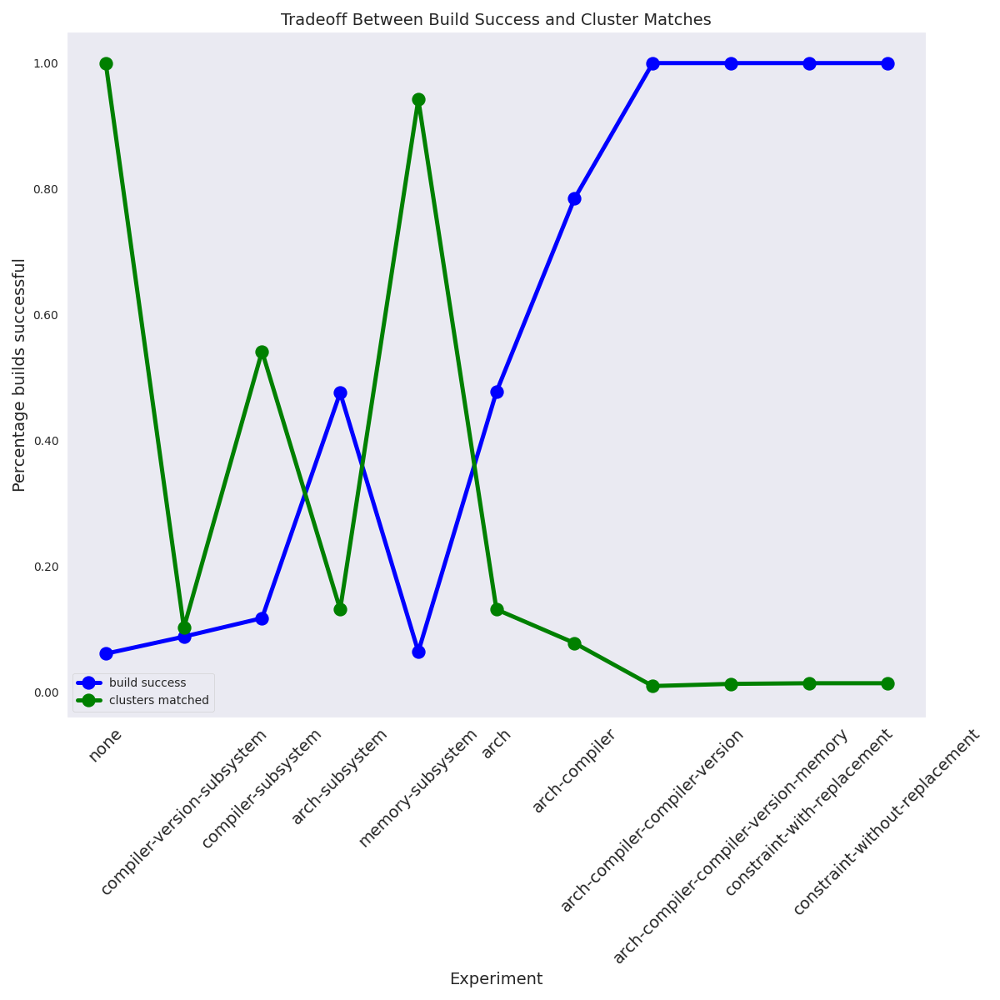
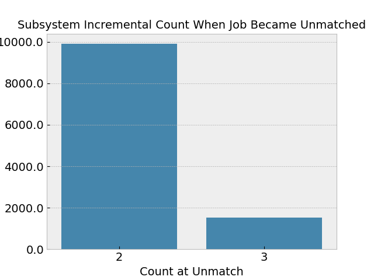

# Descriptive Expression + Scheduler Simulation

> using spack build metadata

From the models in [data](data) we can see that memory (mean and max) is correlated with duration. We can thus view memory as a compatibility feature that is indicative of performance.

## Notes

We are going to generate [clusters](data/clusters) based on the memory linear models derived in the same directory, described in [models.md](data/models.md). As a trick to use the models without needing to have them in rainbow, we are going to save the intercepts and slopes to provide as variables to jobspecs. Here is some random thinking

- more memory provided to jobs means more performant (faster) runs
- we can thus treat runtime (duration) as a performance metric, and memory as the compatibility metadata that influences it.
- we can still include basic compatibility metadata (e.g., arch) to demonstrate the basic needs of compatibility
- we can then vary memory to demonstrate optimization
- we can generate clusters based on values of memory across real spack builds
- we can define the most performant case per package as the memory value where it ran most quickly
- we can then generate real jobspecs that have two variants:
 - memory equal or above a value
 - memory in a range
- Then do the following runs:
 - No compatibility metadata, totally random
 - Gradually add levels, more jobs will run
 - Add memory in a range (will this be ideal)?
 - Add memory above a value
 
Then we want to show in the above that (likely) jobs will be assigned to a smaller number of clusters - this likely wouldn't work. We also can generate costs for each of the above and compare across experiment types. 

## Design

### Base Experiments

We start with base experiments. For these experiments we are using a "random" selection algorithm and not providing any additional subsystem metadata. To assess compatibility:

- A mismatch for arch or compiler is considered a failure. We record it.
- A mismatch for compiler version is a failure only if the compiler needed is newer than the one found.
- For each failure / success above, we give points of 0/1.
- We then calculate memory and cost. We use the slope / intercept of the linear model to calculate the predicted runtime for the build. We compare this to a "fastest runtime" (mean of the top 10% of builds for the package) and calculate a difference in time and cost. 

At the end we should accumulate, for each analysis, a number of build failures / successes (and reasons why). For the succeses, we should assess performance in terms of cost - the total extra time/cost as a result of scheduling inefficiency.

#### 1. Rainbow

First, let's run rainbow. The server is currently lenient to allow us to change the selection algorithm one off for a job, so we can rn it with one config.

```bash
git clone https://github.com/converged-computing/rainbow
cd rainbow
go mod vendor

# See what you can do
go run cmd/server/server.go --help

# Run rainbow using our experiment config
go run cmd/server/server.go --loglevel 6 --global-token rainbow --config ../rainbow-config.yaml 
```

#### 2. Details

Since we have everything locally, we can actually do the entire thing in Python! We will (in one script, I know):

For each cluster:

1. register 100 randomly generated clusters, each with varying ranges of dependency versions (subsystems)
1. register ~219 subsystems (a package version) across 100 clusters
1. run the experiment with ~10K jobspecs without any subsystem metadata
1. run the expemiments adding each subsystem in isolation
1. for each subsystem (randomly sorted):
 - submit each jobspec with added subsystem metadata, adding subsystem metadata until no match (then stopping)
 - for each cluster, get assigned jobs:
  - give a point for each package build dependency version in the right range
  - keep track of overall points (correct version ranges) vs. binary outcomes (anticipated build success / failure)
  - keep track of unmatched jobs, etc.
  - save scores across cluster

I am calling them "anticipated" build success and failure because we cannot be absolutely sure moving a version outside of a desired range would break it, but likely it would. It's also likely the case that I made the ranges too big, and in fact even a small deviance would have broken the build. 

```bash
python run_experiments.py
```

## Results

Parse the results:

```bash
python plot-results.py
```

See [results/scores.json](results/scores.json) for raw data. Note that I just saved summary statistics, which isn't ideal for a real analysis, but this is just exploratory. What we find:

### Build Success Increases with Added Compatibility Metadata

> Compatibility metadata includes ranges of package dependencies needed (dependency subsystems)

We define a successful build as a jobspec that hits a cluster and every software dependency version offered by the cluster is within the range the build has defined that it needs. The reason this would be imperfect is that we cannot make a perfect cluster for every jobspec, but instead we randomly created 500 with different versions, and then allowed the jobspec compatibility metadata to define a _range_ for a subsystem (package version). This is flawed because it assumes that versions close together are compatible, which isn't always the case, but I created the setup as an experiment to test rainbow's new ability to match based on versions. We also are subject to the randomly generated clusters - there is unlikely a perfect cluster to match every version range a build needs.  Regardless, when we have three simple levels:

- **none**: no compatibiility metadata (version ranges) provided
- **single-subsystem**: mean build success across all (200+) subsystems, when tested each separately
- **expanding-subsystem**: adding incremental subsystems until the first "cannot match" result



We do see that build success, although low (maxed at ~14% for the expanding subsystem case) goes up from an almost value of 0. This shows us that there is value to telling the scheduler about the build environment that is needed, however with too many requirements (e.g., a spack build spec can easily have 30-50 dependency needs) it's not reasonable to expect a successful build - there are too many variables that can be mismatched (remember that every cluster has an exact version of every dependency across all jobpsecs, for a total of over 200). However, I can see this setup being very useful when used in context of build software versions that we do care about, namely compiler versions and other system provided software. My suggestion for an extended (next step) for this research question (assessing scheduling for versioned things) is to find a dataset with compiler and system software versions that are tied to known successes and failures. Spack is also a bad model because when it doesn't have a version of something it will just build it. We don't need to discover the software. Here is another view of the same data. Instead of an all or nothing "this won't build because every package is not matched" we instead give marginal points when there is a match. 


Surprisingly, the marginal score of the same experiments is good, meaning that for most packages, spack is choosing a small number or even one specific version, so the variabiity in build success is due to fewer subsystems (package dependency version ranges) that don't match. While again this isn't a realistic use case, for future work it makes me think that we need to not only identify compatibility metadata that we care about, but assess the relative value of each one to contribute to a successful outcome (akin to what we did in the descriptive experiments). For this experiment, I do have data on the level of the subsystem, but because I filtered down to unique builds given just one subsystem, the number of jobs for each is too small to use meaningfully. I digress. Next plots! 

### Incremental Addition of Subsystem Metadata Improves Matching

> But only up to a point!

These plots are looking to answer the question "How much metadata can we ask for before rainbow rejects and says it cannot match?" This is a separate angle from whether the build works or not, and perhaps is a more interesting result than the first. For this first plot, we are looking at the percent of subsystems (dependency metadata ranges) that rainbow could match before it returned a "cannot match" result.


It is interesting because it suggests a trend we have discussed before - adding more metadata is going to matchable up to a certain point (about 50% in these tests) at which case we cannot even schedule the job (and the build outcome is irrelevant). This suggests (again) needing to choose a balance between compatibility metadata we provide and wanting to optimize for a build success or (more likely) application optimal result in terms of performance (not the building use case, but the "run this thing" use case. Here is the same data, but presenting the raw counts instead of an overall percentage.



Despite the fact that these experiments aren't great, it still is a step in a good direction to thinking about better ones. I have some tweaks to rainbow to make and look forward to discussing.
