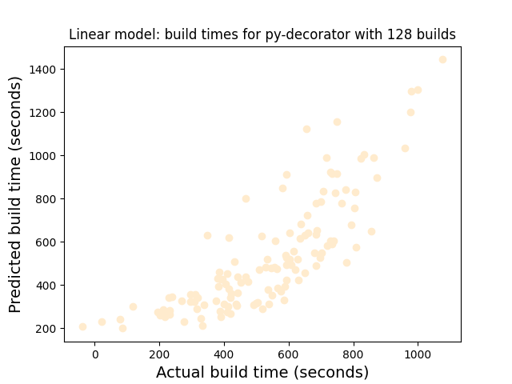
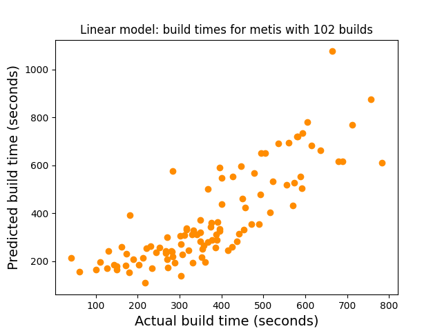
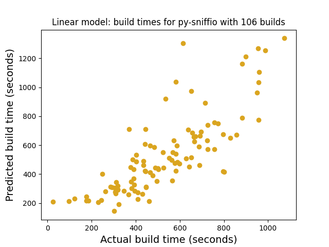
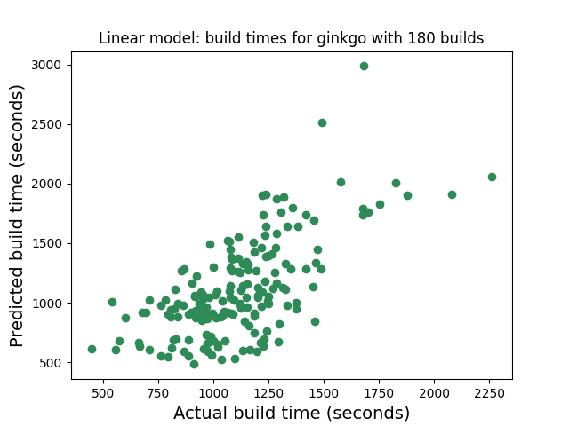

# Linear Models for Package Build Times

## llvm

## flux-core

## camp

## py-tensorflow

## paraview

## py-pandas

## mesa

## gromacs

## intel-tbb

## openpmd-api

## py-numexpr

## py-pytz

## py-wheel

## libxrender

## meson

## py-mpi4py

## py-numpy

## py-flit-core

## py-markupsafe

## conduit

## py-tomli

## py-cycler

## boost

## libx11

## py-versioneer

## py-setuptools

## ninja

## py-mako

## libxcb

## ascent

## py-pyproject-metadata

## py-bottleneck

## mpich

## py-contourpy

## py-setuptools-scm

## py-cppy

## libxext

## py-cython

## netcdf-c

## py-kiwisolver

## py-packaging

## hdf5

## py-certifi

## py-matplotlib

## sz

## adios2

## libxt

## openmpi

## yaksa

## py-six

## rdma-core

## py-pip

## xcb-proto

## libcatalyst

## python

## py-pillow

## py-python-dateutil

## py-pyparsing

## openssh

## py-typing-extensions

## py-pybind11

## mgard

## py-fonttools

## git

## py-torch

## cmake

## kvtree

## py-h5py

## hypre

## mfem

## netlib-scalapack

## fftw

## parallel-netcdf

## py-jupyterlab

## zfp

## py-jinja2

## py-idna

## py-pycparser

## py-decorator

## protobuf

## libjpeg-turbo

## py-ply

## rust

## umpire

## py-oauthlib

## py-pathspec

## py-meson-python

## libpng

## py-gast

## metis

## raja

## py-cffi

## py-pygments

## py-editables

## kokkos

## py-psutil

## py-charset-normalizer

## py-zope-interface

## py-networkx

## py-pyyaml

## py-sniffio

## py-cloudpickle

## py-tornado

## py-send2trash

## py-beniget

## py-websocket-client

## py-trove-classifiers

## py-hatchling

## py-pluggy

## py-wcwidth

## py-scipy

## py-poetry-core

## py-fastjsonschema

## py-calver

## py-webencodings

## py-joblib

## py-markdown

## py-mistune

## py-zope-event

## curl

## snappy

## py-pythran

## py-pandocfilters

## py-pickleshare

## py-parso

## py-greenlet

## py-pyrsistent

## py-prometheus-client

## py-protobuf

## vtk-m

## py-defusedxml

## py-json5

## trilinos

## py-fsspec

## py-nbformat

## petsc

## slate

## ginkgo

## py-hatch-vcs

## py-traitlets

## py-requests

## py-platformdirs

## py-hatch-fancy-pypi-readme

## py-urllib3

## py-hatch-nodejs-version

## superlu-dist

## parmetis

## cabana

## tasmanian

## py-pure-eval

## rankstr

## arborx

## py-jsonschema

## py-pytest-runner

## heffte

## parsec

## hpx

## py-gevent

## redset

## py-attrs

## amrex

## py-jaxlib

## py-ipykernel

## py-ipython

## sundials

## strumpack

## py-filelock

## py-matplotlib-inline

## tau

## caliper

## py-tensorboard

